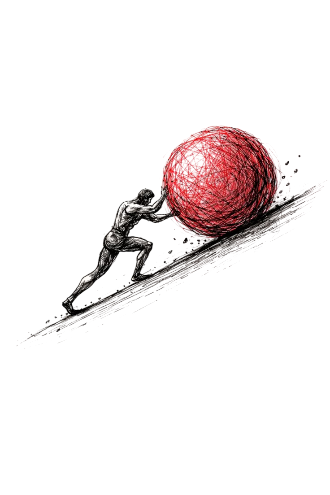
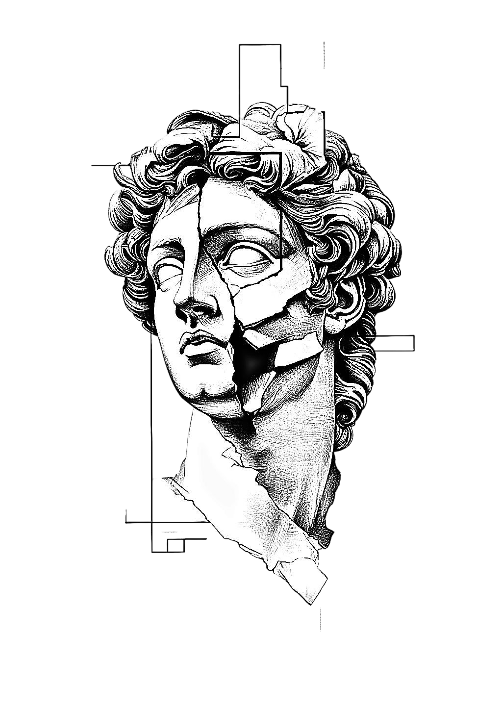
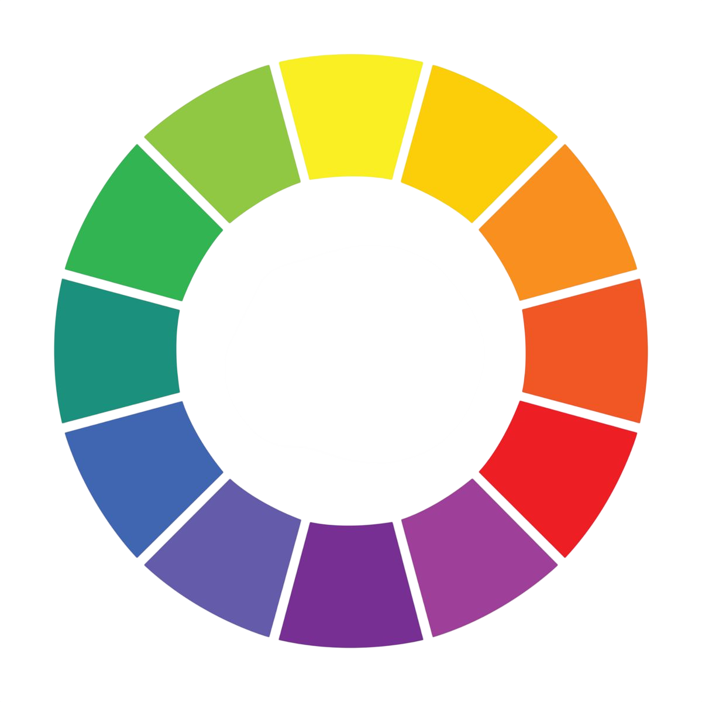
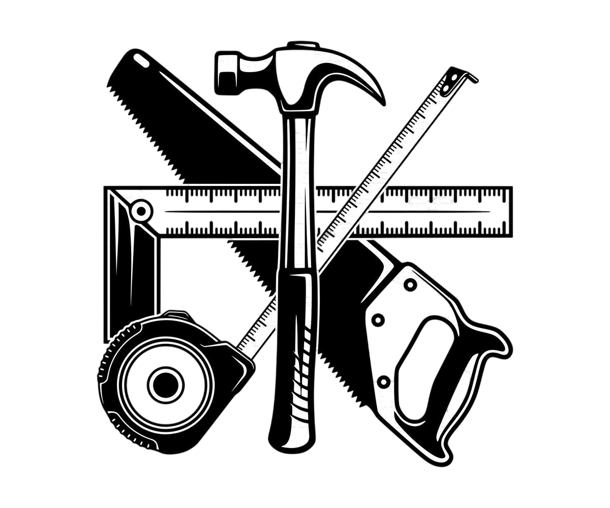

 

<!-- Hero Section -->

 

# Welcome to my **Design Journey.**

### Hey, it's me, **Aaryan.**
*This is my journey log.*
*In this repo, I will share what I did each day, the silly mistakes I made, how I solved them, and what I learned from them.*
*This repository contains all the logs from day one until the end.*

---

 

## 🏛️ Design Philosophy

Design is not decoration — it's communication. Every choice carries intent.

| # | Principle | What it means |
|---|-----------|---------------|
| 1 | **Simplicity** | Remove the unnecessary so the necessary can speak |
| 2 | **Functionality** | Beauty means nothing if it doesn't work |
| 3 | **Consistency** | Patterns build trust; chaos breaks it |
| 4 | **Innovation** | Challenge defaults, push boundaries |
| 5 | **User Experience** | The user is always the final judge |

 

---

 

## 🎨 Color System & Meaning

 

Color is a language. Each hue carries emotion, cultural weight, and psychological impact. In every project I document:

- 🔴 **Red** — Energy, urgency, passion
- 🟠 **Orange** — Warmth, creativity, enthusiasm  
- 🟡 **Yellow** — Optimism, clarity, attention
- 🟢 **Green** — Balance, growth, harmony
- 🔵 **Blue** — Trust, calm, professionalism
- 🟣 **Purple** — Luxury, imagination, depth

---

 

## 🔧 Tools that I am Using

 

| # | Tool | Purpose |
|---|------|---------|
| 1 | **Figma** | UI/UX Design & Prototyping |
| 2 | **Dribbble** | Inspiration & Community |
| 3 | **Pinterest** | Mood boarding & Visual Research |
| 4 | **remove.bg** | Background Removal for Assets |

---

 

## 📓 Daily Logs

> *press and see*

<strong>Day 1</strong> — The Beginning

 

*Log coming soon...*

<strong>Day 2</strong> — Pushing Forward

 

*Log coming soon...*

---

 

*"Every expert was once a beginner. The only way out is through."*

**— Aaryan**

 

